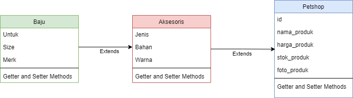
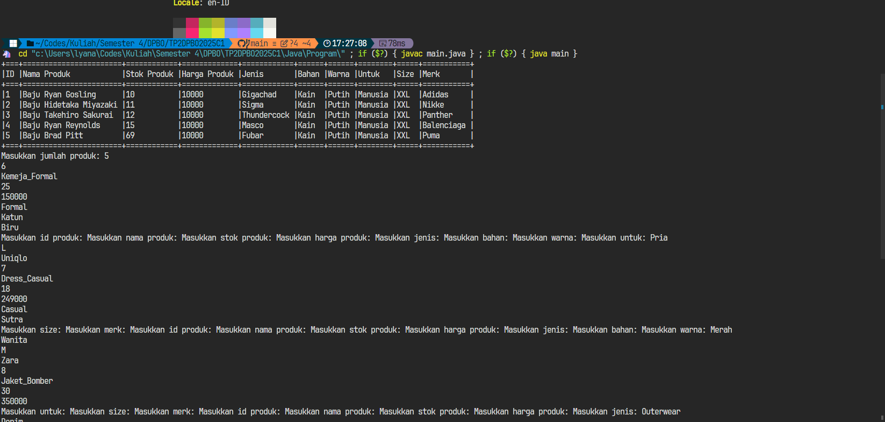
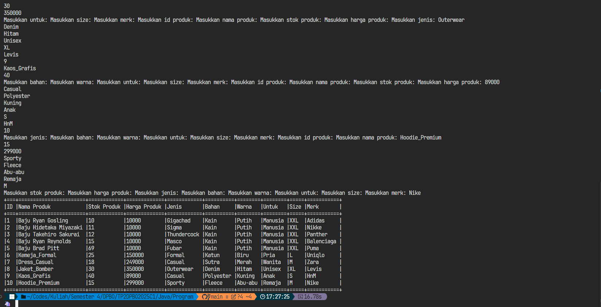
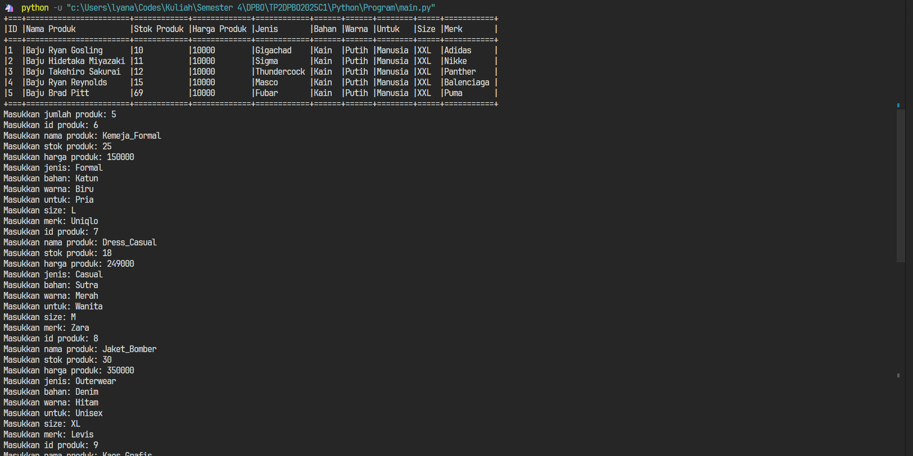
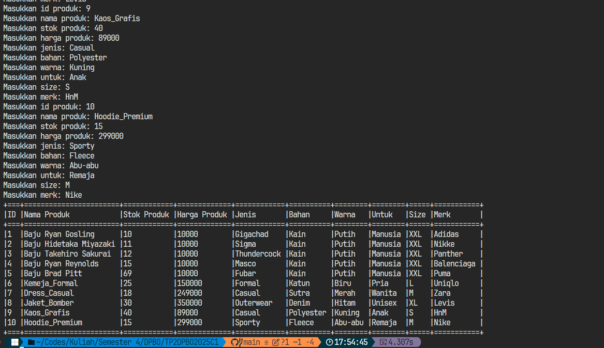
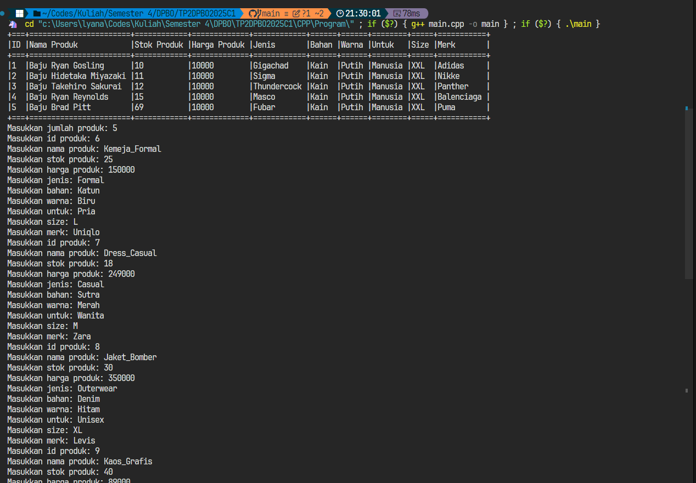
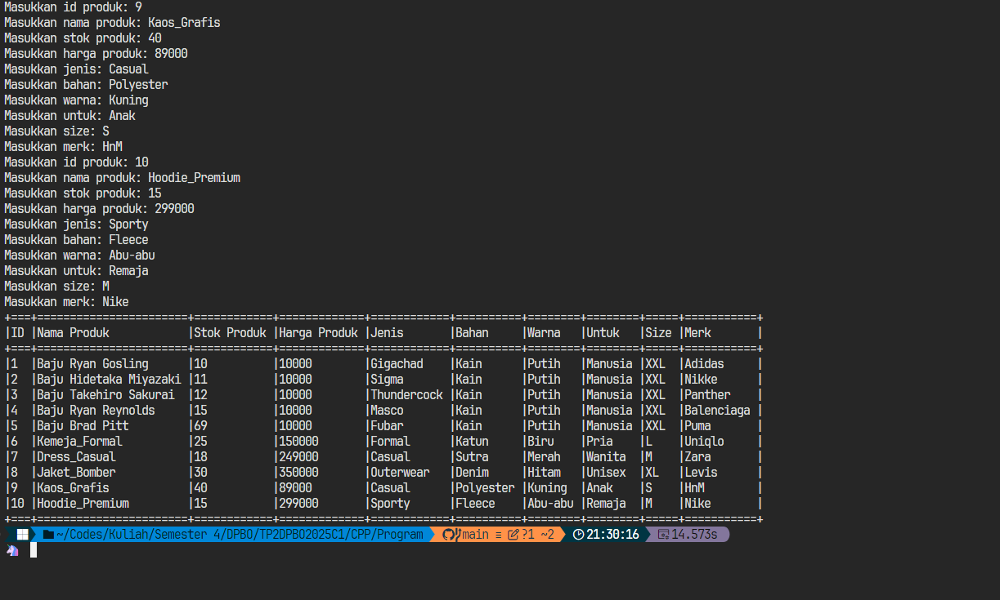
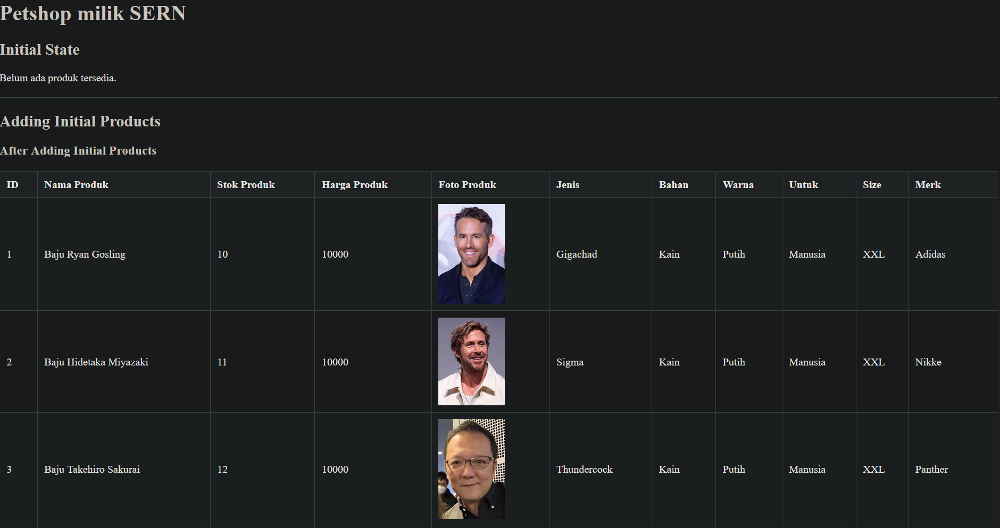
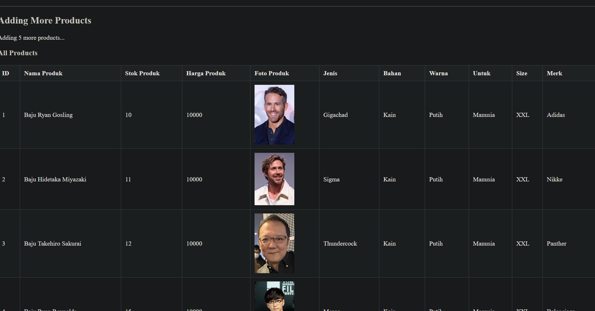

## Janji

Saya Lyan Nazhabil Dzuquwwa dengan NIM 2308428 mengerjakan Latihan Modul 1 dan Tugas Praktikum 1 dalam mata kuliah Desain dan Pemrograman Berorientasi Objek untuk keberkahanNya maka saya tidak melakukan kecurangan seperti yang telah dispesifikasikan. Aamiin.

## Diagram

## Desain Program
Program ini memiliki 3 Class, yaitu PetShop, Aksesoris, dan Baju dengan hubungan multiclass inheritance yang dimana PetShop merupakan parent dari Aksesoris, Aksesoris merupakan Child dari PetShop dan Parent dari Baju, dan Baju merupakan Child dari Aksesoris.

PetShop:
- id
- nama_produk
- harga_produk
- stok_produk
- foto_produk

Aksesoris:
- jenis
- bahan
- warna

Baju:
- untuk
- size
- merk

Notes : untuk atribut foto_produk hanya terdapat pada program di PHP

## Alur Program

Untuk Menjalankan Program, cukup jalankan file main di setiap bahasa, untuk PHP dijalankan di localhost. Pertama input jumlah data yang ingin dimasukkan, selanjutnya input field-field sesuai yang tertera.

## Dokumentasi
Java

Python

CPP

PHP

